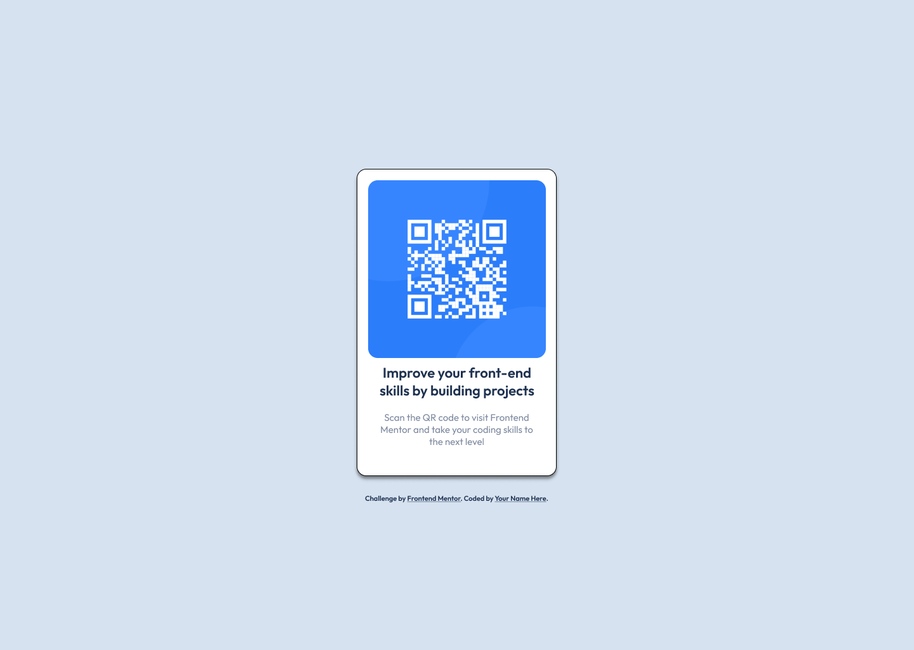

# Qr Code Component 

### Essa é a solução implementada para o desafio [QR-Code Component - Frontend Mentor](https://www.frontendmentor.io/challenges/qr-code-component-iux_sIO_H) de nível iniciante, para melhoria de skills e conhecimento.

## Conteúdos
- [Overview](#overview)
    - [Screenshot](#screenshot)
    - [Links](#links)
- [Processos](#meus-processos)
    - [Build](#build)
    - [Aprendizado](#o-que-aprendi)
    - [Desenvolvimento](#desenvolvimento-contínuo)
- [Autor](#author)

## Overview

### Screenshot


### Links
- Solução: (https://github.com/otiagogf/qr-code-component/)
- Página ativa: (https://otiagogf.github.io/qr-code-component/)

## Meus processos

### Build 
- HTML Semântico
- CSS
- Flexbox

### O que aprendi?

```css 

``` 

### Desenvolvimento contínuo


## Autor 
- Frontend Mentor - [Challenge HUB](https://www.figma.com/file/WwbNODiHJvGodLD2LdTbYY/QR-code-component---Challenge-Frontend-Mentor-(Community)?type=design&node-id=0%3A1&mode=design&t=IwY1KZJlGH2CHoL7-1)